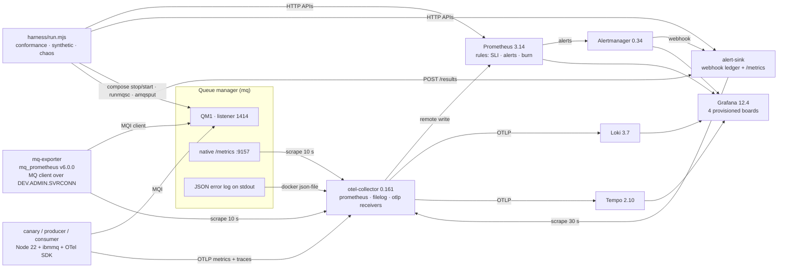
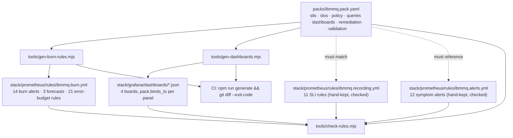
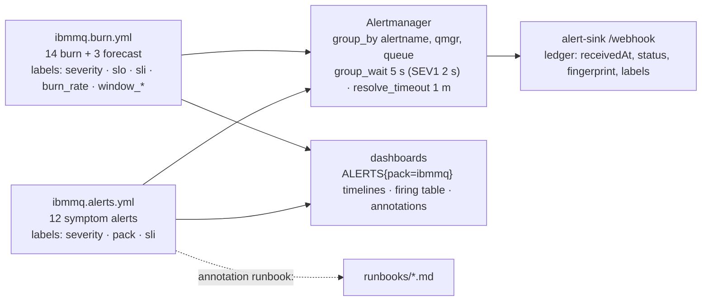
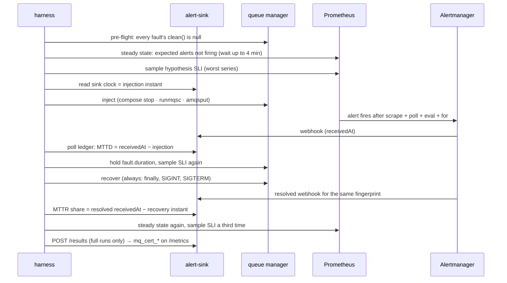

# Architecture

The system, explained four times at increasing depth. Read level 0 to know what it is,
level 1 to find a component, level 2 to change one, level 3 to understand why it is the way
it is. Everything stated here was measured on the live lab; where a number matters, the
place it was measured is named. The companion for taking this to a real queue manager or an
RDQM cluster is [INSTRUMENTING-EXISTING-MQ.md](INSTRUMENTING-EXISTING-MQ.md); what a
certification verdict means is in [CERTIFICATION.md](CERTIFICATION.md).

---

## Level 0: one paragraph

A real IBM MQ queue manager (10.0.0.5, or 9.4 LTS) runs next to a synthetic workload
(a put/get canary and an orders producer/consumer pair) and a complete OpenTelemetry-native
telemetry path: one OTel Collector scrapes the queue manager from two vantage points, tails
its JSON logs and receives the applications' traces and metrics, then feeds Prometheus, Loki
and Tempo behind Grafana. The contract for all of it is a single file,
[`packs/ibmmq.pack.yaml`](../packs/ibmmq.pack.yaml): eight SLIs, eight SLOs, a burn-rate
policy, dashboards, remediation and a validation plan. Generators and a cross-checker keep the
running stack equal to that contract, and a dependency-free harness proves it against the
live queue manager by injecting real faults, timing the alert webhooks that result, and
writing the evidence to a report whose figures the dashboards then display.

```
   contract ──generate/check──▶ stack ──telemetry──▶ stores ──▶ dashboards
      ▲                           │                                 ▲
      └────── harness proves ─────┴── faults, MTTD, MTTR ───────────┘
```

---

## Level 1: the components

### The map



### The services

All sixteen run under one Compose project (`mq-obs`); every host port is bound to loopback
in the `127.0.0.1:2xxxx` block so nothing collides with other local stacks.

| Service | Image (pinned) | Role | Container port | Host port | Configuration |
|---|---|---|---|---|---|
| `mq` | `icr.io/ibm-messaging/mq:10.0.0.5-r1` | the queue manager under test; `MQ_ENABLE_METRICS`, JSON console log, embedded web console | 1414, 9157, 9443 | 21414, 29157, 29443 | `stack/mq/20-observability.mqsc` (auto-run at start) |
| `mq-exporter` | built from `ibm-messaging/mq-metric-samples@v6.0.0` | mq_prometheus as an MQ client: queue, channel and `$SYS` resource metrics | 9157 | 29158 | `stack/mq-exporter/mq_prometheus.yaml`, `Dockerfile` |
| `otel-collector` | `otel/opentelemetry-collector-contrib:0.161.0` | the only telemetry path: scrapes, tails, receives, exports | 4317, 4318, 8888, 13133 | 24317, 24318, 28888, 23133 | `stack/otelcol/config.yaml` |
| `prometheus` | `prom/prometheus:v3.14.0` | TSDB (remote-write receiver on), rule evaluation, 2 d retention | 9090 | 29090 | `stack/prometheus/prometheus.yml`, `rules/*.yml`, `tests/*.yml` |
| `alertmanager` | `prom/alertmanager:v0.34.0` | grouping and routing to the webhook ledger | 9093 | 29093 | `stack/alertmanager/alertmanager.yml` |
| `alert-sink` | `harness/alert-sink` (Node, no deps) | timestamped webhook ledger; stores the last certification run and serves it at `/metrics` | 9095 | 29095 | `harness/alert-sink/server.mjs` |
| `loki` | `grafana/loki:3.7.7` | logs, OTLP ingest, 48 h retention | 3100 | 23100 | `stack/loki/loki.yaml` |
| `tempo` | `grafana/tempo:2.10.1` | traces, OTLP ingest, 48 h retention | 3200, 4317 | 23200 | `stack/tempo/tempo.yaml` |
| `grafana` | `grafana/grafana:12.4.11` | four provisioned dashboards, four datasources, one Grafana-managed heartbeat rule; anonymous Viewer; its own traces to Tempo and `instrument_queries` on (what the grafana reference pack reads); state in the `grafana-data` volume | 3000 | 23000 | `stack/grafana/provisioning/`, `stack/grafana/dashboards/*.json` (generated) |
| `grafana-login-canary` | `curlimages/curl:8.22.0` | one form login every 5 min (the grafana pack's login SLI) | | | `stack/grafana/login-canary.sh` |
| `canary` | `mq-obs/canary:local` (`canary/`) | synthetic put/get probe every 10 s on `APP.CANARY` | | | env in `docker-compose.yaml` |
| `producer` | same image, `MODE=producer` | 5 persistent orders/s to `APP.ORDERS.REQ`, one PRODUCER span each | | | |
| `consumer` | same image, `MODE=consumer` | blocking gets from `APP.ORDERS.REQ`, one CONSUMER span each, linked to the producer's | | | |
| `kafka` | `mq-obs/kafka:3.9.2` (`stack/kafka/`, `apache/kafka:3.9.2` + jmx_exporter 1.6.0) | the kafka reference pack's live target: one KRaft node, RF 1, broker MBeans on :9404 through the Strimzi rule set | 9092, 29092, 9404 | 29092, 29404 | `stack/kafka/Dockerfile`, `jmx-kafka.yml` |
| `kafka-exporter` | `danielqsj/kafka-exporter:v1.10.0` | topics, partitions, replicas, consumer-group offsets and lag | 9308 | 29308 | command in `docker-compose.yaml` |
| `kafka-gen` | same image as `kafka`, `gen.sh` | topics `orders` (50 msg/s) and `payments` (10 msg/s), a committing consumer group on each, from the broker image's own tools | | | `stack/kafka/gen.sh` |

Loki and Tempo are distroless images (no shell), so they carry no Compose healthcheck; the
harness probes their `/ready` itself and records time-to-ready (Loki needs about five minutes
on this configuration, Tempo about fifteen seconds).

### The repository

```
packs/ibmmq.pack.yaml        the contract (ObservabilityPack v1.2)
stack/                       its executable form, one directory per service
canary/                      the synthetic workload (one image, MODE=canary|producer|consumer)
harness/                     run.mjs, checks/{conformance,synthetic,chaos}.mjs, lib/, alert-sink/
tools/                       validate-pack, check-rules, gen-dashboards, gen-burn-rules, verify-dashboards
runbooks/                    one per remediation trigger
docs/catalogue-evidence/     the evidence trail and the live metric inventory
docs/reviews/                adversarial review records
vendor/observogram/          pack schema, validator and YAML parser (copied, read-only)
reports/                     certification reports (git-ignored)
```

---

## Level 2: the planes

The lab is easier to reason about as seven planes that share the same wires. Each subsection
names the files that implement it and the check that proves it.

### 2.1 Contract plane: pack, generators, cross-check



The pack declares; the stack executes; nothing is allowed to drift between them:

- **Generated artefacts.** The burn-rate and forecast alerts and the error-budget recording
  rules are compiled from `spec.policy` by `tools/gen-burn-rules.mjs`, named the way
  Observogram's compiler names them (`<slo>_burn_<factor>x_<short>_<long>`,
  `<slo>_forecast_breach`). The four dashboards are compiled from a panel spec in
  `tools/gen-dashboards.mjs`. CI regenerates both and fails on a non-empty diff, so a
  hand edit of the JSON or of `ibmmq.burn.yml` cannot survive a push.
- **Checked artefacts.** The SLI recording rules and the symptom alerts are written by hand
  and cross-checked: every pack recording rule must exist verbatim as a `record:`, every
  `ref:slis.<id>` rule is resolved to the SLI's own PromQL and compared with the stack's
  expression, every alert the pack references (chaos `expected_alerts`, remediation
  triggers, every policy window) must exist as a rule carrying `severity`, `pack: ibmmq`,
  `sli` and a runbook file, and every dashboard `panel_bindings[].binds_to` must be found in
  some panel's `pack.binds_to`. Generated per-SLO recording rules are compared symmetrically,
  so a stale copy on either side fails.
- **Naming.** Recording rules are `ibmmq:<sli>:<agg>_<window>`. Alert references come in two
  spellings, PascalCase `alertname` and `alert:kebab-case` trigger; both sides are matched
  after stripping the prefix, dashes and underscores and lowercasing.

The eight SLIs and the SLOs built on them:

| SLI | Type | Source | SLO (objective, window) |
|---|---|---|---|
| `qmgr_process_up` | ratio | `up{job="ibmmq-native"}` | 99.9 %, 30 d |
| `qmgr_reachability` | ratio | `ibmmq_qmgr_status{job="ibmmq-exporter"} == 2` | 99.9 %, 30 d |
| `queue_depth_headroom` | threshold 0.8 | `ibmmq_queue_depth / ibmmq_queue_attribute_max_depth`, `APP.*` | 99.9 %, 30 d |
| `oldest_message_age` | threshold 60 s | `ibmmq_queue_oldest_message_age`, `APP.*` except the DLQ | 99 %, 7 d |
| `dlq_depth` | threshold 0 | `ibmmq_queue_depth{queue="APP.DLQ"}` | 99.9 %, 30 d |
| `canary_success` | ratio | `mq_canary_attempts_total{result="ok"}` over all attempts | 99.9 %, 30 d |
| `canary_roundtrip_p99` | threshold 0.5 s | `mq_canary_roundtrip_duration_seconds_bucket{result="ok"}` | 99 %, 30 d |
| `log_write_latency` | threshold 20 ms | `ibmmq_qmgr_log_write_latency_seconds{job="ibmmq-exporter"}` | 99 %, 7 d |

Every exporter gauge is read through `last_over_time(...[30s])`; the reason is in 2.2.

### 2.2 Metrics plane: two vantage points, one path

**Prometheus scrapes itself, Alertmanager, Grafana, Loki, Tempo and the lab's Kafka node** (the
reference-pack targets, jobs `prometheus-self`, `alertmanager`, `grafana`, `loki`, `tempo`,
`kafka-broker`, `kafka-exporter`; `stack/prometheus/prometheus.yml`). Every MQ and application
series arrives by remote write from the collector, whose `prometheus` receiver owns four scrape jobs:

| Job | Target | What it is | Labels added |
|---|---|---|---|
| `ibmmq-native` | `mq:9157` every 10 s | the queue manager's own metrics server (`MQ_ENABLE_METRICS=true`): queue-manager level only, alive as long as the process is | `qmgr` (static), `source=native`; `honor_labels: true` so the endpoint's own `qmgr` label is kept instead of becoming `exported_qmgr` |
| `ibmmq-exporter` | `mq-exporter:9157` every 10 s | mq_prometheus connected as an MQ **client** over `DEV.ADMIN.SVRCONN`: queue, channel and `$SYS` resource metrics; it dies with the listener, the channel, CHLAUTH or CONNAUTH, exactly like an application | `source=exporter`; the exporter itself stamps `qmgr`, `queue`, `channel`, `type`, `platform`, `hostname`, `ENV` |
| `otel-collector` | `127.0.0.1:8888` | the collector's own telemetry | |
| `certification` | `alert-sink:9095` every 30 s | the last harness run: verdict, checks, MTTD and MTTR per alert | |

The remote-write exporter adds `service="ibmmq"` to every series (the pack's pipeline
contract) and keeps `add_metric_suffixes: true`, which is what turns the canary's OTLP
`mq.canary.attempts` into `mq_canary_attempts_total`.

**The disagreement between the two MQ jobs is the diagnosis.** `IBMMQQueueManagerDown` fires
when the native endpoint goes dark; `IBMMQQueueManagerUnreachable` fires when the native
endpoint has been up for a full minute and the client exporter still reports a status other
than RUNNING, joined `on (qmgr)` so one queue manager cannot vouch for another. The chaos
experiments `qmgr-down` and `listener-stopped` prove each side.

**What the exporter's numbers mean** (all measured, all in `docs/catalogue-evidence/ibmmq.md`):

- mq_prometheus only exposes a publication-derived gauge on scrapes where a `$SYS`
  publication arrived. MQ publishes every 10 s and the collector scrapes every 10 s, so about
  one scrape in twelve carries none and writes a staleness marker; every SLI therefore reads
  exporter gauges through `last_over_time(...[30s])`.
- The `$SYS` "count" elements (`ibmmq_queue_mqput_mqput1_count`, `ibmmq_qmgr_commit_count`,
  the channel `messages` and `bytes_*` fields) are per-interval deltas, not counters. The lab
  runs the exporter with `overrideCType: false`, keeps IBM's names as gauges, and derives
  rates as `sum_over_time(x[2m]) / 120`; `rate()` on them under-reported by half.
- The native endpoint's counters already end in `_total` (`ibmmq_qmgr_commit_total`); the
  collector appends `_total` only to OTLP counters.
- A manual `curl` of the exporter consumes the publications the next scrape needed. Judge the
  exporter from Prometheus, never from ad-hoc curls.

**Rules.** Three files, three groups, all on a 10 s evaluation interval:

| File | Content | Origin |
|---|---|---|
| `ibmmq.recording.yml` | 11 SLI recording rules (`ibmmq:<sli>:...`) | hand-kept, cross-checked against the pack |
| `ibmmq.alerts.yml` | 12 symptom alerts | hand-kept, cross-checked, unit-tested (`stack/prometheus/tests/`) |
| `ibmmq.burn.yml` | 5 threshold error-ratio rules, 16 error-budget burn rules (5 m and 1 h per SLO), 14 multi-window burn alerts, 3 forecast alerts | generated from `spec.policy` |

**Timing budget.** 10 s scrape + 10 s exporter poll + 10 s rule evaluation + `for` (10 to
30 s) + Alertmanager `group_wait` (5 s, 2 s for SEV1) is about 55 s worst case against a 60 s
`expected_mttd`. Measured: `IBMMQQueueManagerDown` in 40 to 45 s, `IBMMQQueueFull` 34 to 39 s,
`IBMMQOldestMessageAgeHigh` 100 to 119 s (60 s of age must accrue first; budget 150 s),
`MQCanaryFailing` 55 to 60 s (four failed probes by design; budget 90 s). These are lab
timings; production values live in the pack's `environments.prod.overrides`.

### 2.3 Logs plane

```
docker json-file (every service, compose labels in the envelope)
  └─ filelog receiver: /var/lib/docker/containers/*/*-json.log, start_at: beginning, offsets in the otelcol-state volume
       ├─ json_parser  docker envelope → timestamp, attrs.{compose project, service}
       ├─ filter       keep only project mq-obs (the glob is host-wide)
       ├─ json_parser  MQ console JSON (ibm_messageId / ibm_datetime / mq_containerlog) → attributes.mq, severity from loglevel
       ├─ json_parser  app JSON (canary/producer/consumer: ts, level, service, msg, trace_id, span_id) → attributes.app
       ├─ move/add     resource.service.name per ENTRY (app.service, or ibmmq for MQ lines, or the compose service name)
       └─ transform    trace_id/span_id onto app records, mq.qmgr.name / mq.message_id / mq.process onto MQ records, body = MQ message text
  └─ otlphttp → Loki (index labels: service.name, service.namespace, deployment.environment, mq.qmgr.name)
```

Two rules learned live: service identity is set per entry inside the filelog receiver (an
OTTL `set(resource...)` in log context mutates one resource shared by the whole batch and
mislabels other containers' lines), and lines that are neither MQ JSON nor app JSON are named
after the container that wrote them, never lumped under a synthetic `docker` service.
Conformance C8 proves the queue manager's JSON lines are in Loki with the parsed labels and
that the applications' lines carry `trace_id`.

The MQ record itself (one line of the container's console log, identical in shape to the
`AMQERR01.json` file a non-container queue manager writes):

```json
{"ibm_messageId":"AMQ6287I","ibm_datetime":"2026-09-16T14:53:58.609Z","ibm_serverName":"QM1","type":"mq_log",
 "host":"mq","loglevel":"INFO","module":"amqxeida.c:7261","ibm_sequence":"1789570438_609523966",
 "ibm_processId":"1736","ibm_threadId":"3","ibm_version":"10.0.0.5","ibm_processName":"amqzmuc0",
 "ibm_userName":"mqm","ibm_installationName":"Installation1","ibm_installationDir":"/opt/mqm",
 "ibm_commentInsert1":"Linux ...","ibm_arithInsert1":0,"message":"AMQ6287I: IBM MQ V10.0.0.5 (p1000-005-260828)."}
```

### 2.4 Traces plane

The three applications run the OTel Node SDK (`canary/src/otel.mjs`), exporting OTLP/HTTP to
the collector, which forwards spans to Tempo over OTLP gRPC. Context crosses the queue
manager inside the message: the `ibmmq` module, when `@opentelemetry/api` is already loaded
(hence the import order in `index.mjs`), puts `traceparent` and `tracestate` on every MQPUT
as message properties and, on MQGET, adds a span **link** from the active consumer span to the
producer's context. The consumer therefore keeps its CONSUMER span active around the GET. Every
GET passes `MQGMO_NO_PROPERTIES`: with the queue default `PROPCTL(COMPAT)` and no message
handle, those properties would arrive as an `MQRFH2` header prepended to the body (format
`MQHRF2`), which broke the canary's payload comparison on the first live run. Conformance C9
counts consumer `receive` spans in Tempo whose link points at another trace (30 of 30 on the
certified runs). Grafana's Tempo datasource links traces to Loki by `service.name` and to the
canary p99 recording rule.

### 2.5 Alerting plane



Every rule carries `severity: SEV1|SEV2|SEV3`, `pack: ibmmq` and `sli: <id>` (`slo: <id>` on
burn rules); the synthetic checks, the dashboard annotation and the firing table all select
`ALERTS{pack="ibmmq"}`, so an alert without the label is invisible to them. Four alerts exist
because something was silent or noisy live:

| Alert | Why it is shaped this way |
|---|---|
| `IBMMQTelemetryPipelineDown` | `absent_over_time(up{job="ibmmq-native"}[1m])`: if the collector dies every `up == 0` selector is empty, not zero, and nothing else fires |
| `IBMMQExporterDown` | `keep_firing_for: 1m`: during a queue-manager outage mq_prometheus answers about one scrape in five while it retries, and the alert flapped every 50 s |
| `IBMMQQueueManagerUnreachable` | joined `on (qmgr)` and gated on `min_over_time(up{native}[1m]) == 1`, so the exporter's reconnect after a restart is not paged as a listener fault |
| `MQCanaryFailing` | flat-counter form (no `ok` increment in 40 s while attempts continue), plus `absent()`, plus a hung-canary branch (no attempt of any kind in 2 min); the earlier success-ratio form fired at 105 to 109 s |

The pack's production routing (`spec.alerting.routes`: SEV1 to MS Teams, PagerDuty and the
webhook; SEV2 to Teams and the webhook; SEV3 to the team channel) is declared, not
implemented here; the lab routes everything to the ledger.

### 2.6 Synthetic plane

One image, three roles, all connecting as the `app` user over `DEV.APP.SVRCONN`:

| Role | Queue | Behaviour | Instruments (OTLP name, Prometheus name) |
|---|---|---|---|
| canary | `APP.CANARY` | every 10 s: put a non-persistent message with a 30 s expiry, get it back by MsgId with a 5 s wait, compare the payload; timing starts after connect | `mq.canary.roundtrip.duration` histogram (`mq_canary_roundtrip_duration_seconds_bucket`), `mq.canary.attempts{result}` (`mq_canary_attempts_total`) |
| producer | `APP.ORDERS.REQ` | 5 persistent JSON orders per second, one PRODUCER span each | `mq.orders.produced`, `mq.orders.put.errors{reason,mqrc}` |
| consumer | `APP.ORDERS.REQ` | blocking gets (1 s wait), 20 ms of simulated work inside a child span, one CONSUMER span each | `mq.orders.consumed`, `mq.orders.get.errors{reason,mqrc}` |

The `result` label is a stable, low-cardinality classification of MQ reason codes
(`ok`, `get_timeout`, `payload_mismatch`, `connect_failed`, `auth_failed`,
`put_failed_q_full`, `message_too_large`, `handle_invalid`, `error`). Failures release the
connection and back off; oversized messages are discarded rather than left at the head of the
queue; SIGTERM disconnects cleanly so the queue manager does not log a broken connection.

### 2.7 Certification plane

The harness (`harness/run.mjs`, Node 20 built-ins only) runs three suites and writes
`reports/cert-report.{json,md,html}`. Exit code 0 PASS, 1 WARN, 2 FAIL, 3 the harness itself
failed (a partial report with verdict ERROR is written).

| Suite | Checks | What it proves |
|---|---|---|
| Conformance C1 to C10 | components ready (waits up to 6 min, records time-to-ready); both MQ jobs up; every SLI returns data; every recording rule loaded and producing; every referenced alert present and healthy; required metric families present; dashboards and datasources provisioned; MQ logs parsed in Loki and app logs trace-correlated; the three services in Tempo with consumer spans linked to producer traces; collector export counters | the stack implements the pack |
| Synthetic S1 to S6 | canary volume, success ratio, p99; orders flowing with depth and age inside the SLI thresholds; no symptom alert firing; no fast-window burn alert firing (slow windows only WARN) | the workload is healthy right now |
| Chaos, one experiment per `validation.chaos_experiments[]` | see below | the alerts detect real faults within budget and resolve |



MTTD is measured where a human would first hear about the fault: at webhook receipt, on the
sink's own clock, never on Alertmanager's `startsAt`. The five experiments and what they
expect:

| id | fault | expected alerts | budget |
|---|---|---|---|
| `qmgr-down` | `docker compose stop mq` for 90 s | `IBMMQQueueManagerDown`, `MQCanaryFailing` | 90 s |
| `listener-stopped` | `STOP LISTENER` plus both SVRCONN channels force-stopped, 90 s | `IBMMQQueueManagerUnreachable`, `MQCanaryFailing` | 90 s |
| `queue-full` | 200 `amqsput` on `APP.BURST` (MAXDEPTH 200) | `IBMMQQueueDepthHigh`, `IBMMQQueueFull` | 60 s |
| `consumer-stall` | stop the consumer for 150 s | `IBMMQOldestMessageAgeHigh` | 150 s |
| `dlq-poison` | 3 `amqsput` on `APP.DLQ` | `IBMMQDeadLetterQueueNotEmpty` | 60 s |

The chaos suite refuses to inject on a lab that still shows a previous fault, recovers the
in-flight experiment on Ctrl-C, and `--recover` repairs a lab a killed run left behind. A full
run publishes its summary to the alert-sink, the collector scrapes it as job `certification`,
and the boards' validation row shows the last verdict, MTTD and MTTR p50/p95 against the pack
baselines (1 m / 2 m and 15 m / 45 m) and every alert's detection time against its budget.

### 2.8 Dashboards

Four boards in the Grafana folder "IBM MQ", all generated, all bound to the pack:

| uid | Title | Content |
|---|---|---|
| `ibmmq-unified` | IBM MQ · Unified Observability | everything, in the pack's own section order: SLIs and SLOs; validation (last verdict, MTTD, MTTR, per-alert detection, checks per suite, canary and orders flow); policy and alerting; remediation table generated from the pack; signals (availability, queues with headroom, channels, resources); pipelines; logs and traces |
| `ibmmq-overview` | IBM MQ · Overview | the eight SLIs and two SLOs at a glance |
| `ibmmq-queues` | IBM MQ · Queues & Channels | per-queue depth, throughput (delta estimator) and per-channel status |
| `ibmmq-slo-burn` | IBM MQ · SLO burn rates | burn per SLO, coloured by that SLO's own policy factors |

The visual system (one palette, value-coloured stats with sparklines, gauges for bounded
resources, bar gauges for "how close to the limit", state timelines with `color.mode: fixed`
because Grafana 12 ignores value-mapping colours otherwise, smooth lines with nulls bridged
across exporter gaps, dashed SLO thresholds) is documented in the generator header.
`npm run verify:dashboards` executes every panel target against the live stack, instant and
range, and refuses to judge emptiness while a symptom alert is firing.

---

## Level 3: decisions, with the evidence

| Decision | Evidence | Where |
|---|---|---|
| The collector scrapes; Prometheus only receives | one telemetry path for all three signals, identical to the production shape (collector to Mimir, Loki, Tempo), so the lab certifies the pipeline that ships | `stack/otelcol/config.yaml`, pack `spec.pipelines` |
| Two MQ scrape jobs | native endpoint is process liveness (queue-manager level only); the client exporter is application-visible reachability plus queue and channel detail; `qmgr-down` and `listener-stopped` are only distinguishable with both | evidence §1, chaos results |
| Tempo, not Jaeger | Jaeger 2.21 removed the v1 HTTP query API and Grafana 12.4's Jaeger datasource speaks only that API: Explore and log-to-trace links were dead | evidence §3, `stack/tempo/tempo.yaml` header |
| MTTD from the webhook ledger | Alertmanager's `startsAt` is the evaluation time, not the delivery time; the sink keeps the raw payloads and the harness never trusts its own clock alone | `harness/alert-sink/server.mjs`, `harness/checks/chaos.mjs` |
| `last_over_time(...[30s])` on every exporter gauge | one scrape in twelve carries no `$SYS` publication (55 of 60 samples over 10 min) | evidence §4 |
| `overrideCType: false`, rates as `sum_over_time / window` | the `$SYS` count elements and the channel counters are per-interval deltas; `rate()` gave 5.06 msg/s against 10.15 measured by two independent methods | evidence §4 |
| `honor_labels: true` on the native job | without it the endpoint's `qmgr` became `exported_qmgr` next to the static label | evidence §4 |
| `MQGMO_NO_PROPERTIES` on every GET | trace-context properties arrived as an MQRFH2 header in the body | first live run, item 4 in STATUS.md |
| `or vector(0)` in the canary ratio | with 100 % failures there is no `result="ok"` series and a bare sum is empty, so `MQCanaryFailing` never fired | first live run, item 5 |
| Flat-counter canary alert | the success-ratio form became active 69 s after the fault and fired at 105 to 109 s; the flat-counter form fires at 55 to 60 s | evidence §5 |
| `IBMMQTelemetryPipelineDown` | a dead collector empties every `up == 0` selector; the first symptom would have been the canary alert five minutes later, blaming the canary | adversarial review 2026-09-16 |
| `keep_firing_for: 1m` on `IBMMQExporterDown` | six false resolved webhooks over three `qmgr-down` runs | adversarial review |
| `ALTER TOPIC('SYSTEM.ADMIN.TOPIC') USEDLQ(NO)` | an exporter nobody scraped filled its temporary reply queue and dead-lettered about 4 publications/s: a false DLQ alert on a healthy queue manager | `stack/mq/20-observability.mqsc` |
| `STOP LISTENER` plus channel force-stop | stopping the listener alone leaves established client conversations working and nothing is detected | evidence §5 |
| Collector starts after the queue manager is healthy | a fresh start otherwise records a minute of `up=0` that burns the 1 h budget and fires the availability burn alert on a healthy stack | `docker-compose.yaml` `depends_on` |
| `start_at: beginning` in filelog | every container's startup lines were missing from Loki on a fresh stack; offsets persist in a volume so restarts do not re-read | `stack/otelcol/config.yaml` |
| Burn-rate PromQL deviates from Observogram's compiler in five places | measured failures of the naive forms: since-start averages on a fresh TSDB, single-sample SEV1 re-fires, forecast echo after outages, 7 d extrapolation of a 1 d slope, forecast severity not routed | evidence §8, generator header, upstream issues drafted 2026-09-17 |
| `mem_limit: 512m` plus `restart: unless-stopped` on the apps | the consumer's native heap grows about 1 KB per GET inside the client library; bounding it recycles the container roughly daily instead of exhausting the host | STATUS.md, consumer memory |
| Every image input pinned to content | base images by digest, the exporter source tag by commit, the IBM client tarball by SHA-256, `MQIJS_VRM` pinned | `stack/mq-exporter/Dockerfile`, `canary/Dockerfile` |

---

## Level 4: operating it

**Lifecycle.** `npm run up` builds and waits (about five minutes cold on Windows); `npm run
down` removes volumes. Bind-mounted configurations (collector, Prometheus rules, Alertmanager,
Loki, Tempo) are read at process start only, and Compose does not recreate a container because
a mounted file changed: after editing one, `docker compose restart <service>` (Prometheus
rules: `curl -X POST :29090/-/reload`), otherwise you certify the old process.

**Changing something.** A change to an SLI, a recording rule, an alert or a dashboard binding
is a change in both the pack and the matching file under `stack/`; `node tools/check-rules.mjs`
must stay green. Dashboards and burn rules are regenerated with `npm run generate`, never
edited. New alerts need the three labels and a runbook. New chaos experiments need a pack
entry, a fault implementation in `harness/checks/chaos.mjs` and any MQ object in the MQSC
file. New metric names need evidence in `docs/catalogue-evidence/ibmmq.md` first.

**Validation before a push.** Static: `npm test`, `node tools/check-rules.mjs`, `docker compose
config --quiet`, `promtool check rules` and `promtool test rules`, `otelcol-contrib validate`,
`amtool check-config`, `npm run generate && git diff --exit-code`. Live, when anything under
`stack/`, `canary/` or `harness/` changed: restart the affected services, `npm run
verify:dashboards`, `npm run certify:quick`, and `npm run certify` for chaos changes. The
report in `reports/` is the artefact; STATUS.md is the handoff.

**Things that bite** (all measured): a `docker compose run` container left behind keeps an
unscraped exporter alive; a background command ending in `tail` reports `tail`'s exit code; a
harness run killed by a tool timeout leaves its fault injected (`--recover`); Git Bash on
Windows rewrites `/etc/...` arguments unless `MSYS_NO_PATHCONV=1` is set; a CRLF Dockerfile
does not build, so `.gitattributes` forces LF; a laptop standby freezes the whole lab and
fires the canary alert for ten seconds on resume.
