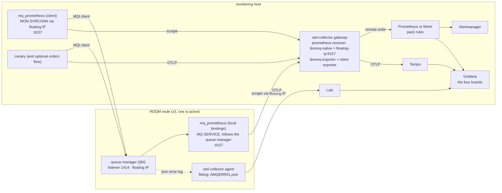

# Instrumenting an existing queue manager or RDQM cluster

How to make a queue manager you already run produce the same telemetry as the reference
lab, so the pack's SLIs, alerts, dashboards and checks apply to it unchanged. It covers a
single queue manager on Linux, a multi-instance queue manager, an RDQM high-availability
group (three nodes, DRBD and Pacemaker, floating IP) and a uniform cluster of several queue
managers. It does not cover z/OS or IBM i.

**What is verified and what is not.** Every MQSC snippet in this guide was syntax-checked
with `runmqsc -v` against MQ 10.0.0.5, the collector and Prometheus snippets were validated
with the pinned binaries, and the authority set in 2.4 was established by running the
exporter as a non-administrative user against the lab queue manager until it produced the
same 175 metric families as the reference inventory (the rounds are in appendix A). The RDQM
specifics come from IBM's documentation and from what the lab measured about the same
components; no RDQM group was available while writing this, and section 8 says so where it
matters. The architecture the lab implements is in [ARCHITECTURE.md](ARCHITECTURE.md).

---

## 0. What "the same metrics" means

The pack's contract is a small set of series with exact names, exact scrape-job names and a
handful of labels. Reproduce these and everything above them (recording rules, burn-rate
policy, alerts, boards, the conformance checks) works without modification.

| Series | Scrape job | Used by |
|---|---|---|
| `up` | `ibmmq-native` | SLI `qmgr_process_up`, `IBMMQQueueManagerDown`, `IBMMQTelemetryPipelineDown`, the availability burn alerts |
| `ibmmq_qmgr_status` (2 = RUNNING) | `ibmmq-exporter` | SLI `qmgr_reachability`, `IBMMQQueueManagerUnreachable` |
| `ibmmq_queue_depth`, `ibmmq_queue_attribute_max_depth` | `ibmmq-exporter` | SLI `queue_depth_headroom`, `IBMMQQueueDepthHigh`, `IBMMQQueueFull`, SLI `dlq_depth` |
| `ibmmq_queue_oldest_message_age` | `ibmmq-exporter` | SLI `oldest_message_age`, `IBMMQOldestMessageAgeHigh` (needs `MONQ`) |
| `ibmmq_qmgr_log_write_latency_seconds` | `ibmmq-exporter` | SLI `log_write_latency` |
| `ibmmq_qmgr_queue_manager_file_system_free_space_percentage` | `ibmmq-exporter` | `IBMMQFileSystemLow` |
| `ibmmq_channel_status_squash`, `ibmmq_qmgr_connection_count` | `ibmmq-exporter` | conformance C6, dashboards |
| `mq_canary_attempts_total{result}`, `mq_canary_roundtrip_duration_seconds_bucket` | OTLP from the canary | SLIs `canary_success`, `canary_roundtrip_p99`, `MQCanaryFailing` |
| `ibmmq_qmgr_commit_total` | `ibmmq-native` | conformance C6 and dashboards only (see 0.2) |

Labels: `job` exactly as above; `qmgr` on every MQ series (the exporter stamps it, the
native job carries it as a static label with `honor_labels: true`); `queue` and `channel`
as mq_prometheus emits them; `service="ibmmq"` on every series (added at remote write or as a
target label). Logs must reach Loki with `service_name="ibmmq"` and `mq_qmgr_name`.

The full reference inventory, 88 native names and 175 exporter names as stored in Prometheus,
is [`catalogue-evidence/ibmmq-live-metrics-2026-09-16.md`](catalogue-evidence/ibmmq-live-metrics-2026-09-16.md).

### 0.1 Deployment shapes

| Shape | What changes against the lab |
|---|---|
| The IBM MQ container image (Kubernetes, OpenShift, Compose) | nothing: `MQ_ENABLE_METRICS=true` gives the native endpoint, `MQ_LOGGING_CONSOLE_FORMAT=json` the logs; point the two scrape jobs and the filelog receiver at them |
| A queue manager installed on Linux (single or multi-instance) | there is no native `/metrics`; both vantage points are mq_prometheus (0.2); logs come from `AMQERR01.json` files (section 5) |
| RDQM high availability | as above, plus: the queue manager moves between three nodes, so the local exporter must follow it (an MQ SERVICE) and be scraped through the floating IP; users, binaries and agent configuration must exist on every node (section 8) |
| RDQM disaster recovery | the DR secondary is not running the queue manager; only the primary is instrumented; the DR state is a separate signal (8.4) |
| Uniform cluster or any set of queue managers | one exporter pair per queue manager; the `qmgr` label separates them; the ratio SLIs become "fraction of queue managers" (8.5) |

### 0.2 The vantage points outside the container

The lab's differential diagnosis rests on two jobs: the queue manager's own metrics server
(alive as long as the process is) and a client exporter over a SVRCONN channel (alive only
when applications could connect). Outside the container image the queue manager has no
built-in metrics server, so both jobs are instances of mq_prometheus:

| Lab job | Lab source | Existing queue manager |
|---|---|---|
| `ibmmq-native` | the container's Go metrics server, queue-manager level, `ibmmq_qmgr_*_total` counters | mq_prometheus with **local bindings**, started by the queue manager as an MQ SERVICE, queue-manager level only (3.2) |
| `ibmmq-exporter` | mq_prometheus as an MQ client over `DEV.ADMIN.SVRCONN` | mq_prometheus as an MQ client over a dedicated monitoring SVRCONN, from the monitoring host (3.3) |

`up{job="ibmmq-native"}` keeps its meaning: a local-bindings exporter started and stopped by
the queue manager answers exactly while the queue manager runs. The SLIs, the alerts and the
burn-rate rules use nothing else from that job. Two things do read the container's specific
names and will not find them: conformance C6 requires `ibmmq_qmgr_commit_total{job="ibmmq-native"}`,
and 25 panel targets of the unified board read `job="ibmmq-native"` series. Of those 25 names,
8 are gauges the exporter also serves (7 under the same name: log latency, log space, CPU, RAM,
file system), 16 are the container's cumulative `_total` counters whose exporter equivalents
are per-interval deltas, and 1 has no equivalent (appendix B). Section 10 lists this as a gap
with the intended fix.

---

## 1. The shape of it



For a single queue manager on one Linux host, collapse the left box to that host; the same
roles apply. For the container image, the left box is the pod and `LX` is the built-in
endpoint.

---

## 2. Step 1: the queue manager

### 2.1 Monitoring attributes

Real-time queue monitoring is what makes `ibmmq_queue_oldest_message_age` (DIS QSTATUS
MSGAGE) and the queue-time fields exist; channel monitoring does the same for the channel
activity fields. Queues and channels defined with `MONQ(QMGR)` / `MONCHL(QMGR)`, the
default, inherit the queue manager value.

```mqsc
ALTER QMGR MONQ(HIGH) MONCHL(HIGH)
ALTER QMGR MAXHANDS(2048)
ALTER TOPIC('SYSTEM.ADMIN.TOPIC') USEDLQ(NO)
DISPLAY QMGR DEADQ MONQ MONCHL MAXHANDS CONNAUTH CHLAUTH
DISPLAY QLOCAL(*) WHERE(MONQ EQ OFF) MONQ
```

- `MAXHANDS`: mq_prometheus opens one subscription per monitored queue and metric class; the
  default of 256 handles is exhausted by a few dozen queues.
- `USEDLQ(NO)` on `SYSTEM.ADMIN.TOPIC`, the root of the `$SYS/MQ` tree: the resource
  publications the exporters subscribe to are non-persistent and must never be dead-lettered.
  In the lab an exporter that stopped being scraped filled its temporary reply queue and put
  about four publications per second on the dead-letter queue, a false
  `IBMMQDeadLetterQueueNotEmpty` on a healthy queue manager. With `NPMSGDLV(ALLAVAIL)` the
  undeliverable copy is discarded instead.
- The lab also sets `STATQ(ON) STATMQI(ON) STATCHL(HIGH) STATINT(60)` and the performance
  and channel event switches. mq_prometheus in the configuration used here
  (`usePublications: true`, `useStatistics: false`) does not read statistics events, so they
  are optional; the `$SYS/MQ/INFO/QMGR/<qmgr>/Monitor` publications the exporter uses are
  produced by every 9.x and 10.x queue manager without further configuration.
- The last line lists queues that opt out of monitoring; those will have no message age.

### 2.2 The dead-letter queue

The pack's `dlq_depth` SLI reads the depth of the queue named by `DISPLAY QMGR DEADQ`. The
lab names it `APP.DLQ`; your queue manager most likely names it `SYSTEM.DEAD.LETTER.QUEUE` or
a site name. Section 7.1 shows where that name is substituted.

### 2.3 A monitoring identity and channel

Both exporters and the canary connect as MQ clients. Give them their own OS user and their
own SVRCONN channel, so their authority is small and their traffic is recognisable:

- OS user `mqmon` (the exporters) and `mqcanary` (the canary), not members of `mqm`, with
  passwords. `CONNAUTH` on the queue manager must check client passwords: an `AUTHINFO` of
  type `IDPWOS` with `CHCKCLNT(REQDADM)` or `REQUIRED` and `ADOPTCTX(YES)`, which is the
  default on a 9.x or 10.x queue manager created with `crtmqm`. On RDQM the users must exist
  on all three nodes with the same UID and GID (8.2).
- One channel per identity, mapped by CHLAUTH from the monitoring host's address range and
  requiring a password:

```mqsc
DEFINE CHANNEL('MON.SVRCONN') CHLTYPE(SVRCONN) TRPTYPE(TCP) MCAUSER('mqmon') DESCR('mq_prometheus client') REPLACE
SET CHLAUTH('MON.SVRCONN') TYPE(ADDRESSMAP) ADDRESS('10.20.*') USERSRC(MAP) MCAUSER('mqmon') CHCKCLNT(REQUIRED) DESCR('monitoring hosts only') ACTION(REPLACE)
DEFINE CHANNEL('CANARY.SVRCONN') CHLTYPE(SVRCONN) TRPTYPE(TCP) MCAUSER('mqcanary') DESCR('synthetic canary') REPLACE
SET CHLAUTH('CANARY.SVRCONN') TYPE(ADDRESSMAP) ADDRESS('10.20.*') USERSRC(MAP) MCAUSER('mqcanary') CHCKCLNT(REQUIRED) DESCR('monitoring hosts only') ACTION(REPLACE)
DISPLAY CHLAUTH('MON.SVRCONN') ALL
```

Replace the address pattern with the monitoring hosts' (CHLAUTH takes wildcards and per-octet
ranges such as `10.20.1-40.*`, not CIDR notation). The default CHLAUTH rules that block
privileged users on every SVRCONN stay in force and do not affect these users.

TLS: add `SSLCIPH` and `SSLCAUTH` to the channels as your policy requires. mq_prometheus then
needs a CCDT (`connection.ccdtUrl`) because its plain `connName`/`channel` mode is plaintext
only. The canary in this repository has no TLS support yet (section 10).

### 2.4 Authorities for the monitoring user

The set below was found by running mq_prometheus v6.0.0 as a non-administrative user against
the lab's MQ 10.0.0.5 queue manager, granting one thing at a time until it produced the same
175 metric families as the reference inventory, and then removing grants until something
broke (appendix A). It is sufficient for the configuration in 3.3 (`useObjectStatus` and
`usePublications` on, `useResetQStats` off) and each line is needed.

```mqsc
SET AUTHREC OBJTYPE(QMGR) PRINCIPAL('mqmon') AUTHADD(CONNECT,INQ,DSP)
SET AUTHREC PROFILE('SYSTEM.ADMIN.COMMAND.QUEUE') OBJTYPE(QUEUE) PRINCIPAL('mqmon') AUTHADD(PUT)
SET AUTHREC PROFILE('SYSTEM.DEFAULT.MODEL.QUEUE') OBJTYPE(QUEUE) PRINCIPAL('mqmon') AUTHADD(GET,PUT,INQ)
SET AUTHREC PROFILE('SYSTEM.ADMIN.TOPIC') OBJTYPE(TOPIC) PRINCIPAL('mqmon') AUTHADD(SUB)
SET AUTHREC PROFILE('APP.**') OBJTYPE(QUEUE) PRINCIPAL('mqmon') AUTHADD(DSP)
SET AUTHREC PROFILE('SYSTEM.DEAD.LETTER.QUEUE') OBJTYPE(QUEUE) PRINCIPAL('mqmon') AUTHADD(DSP)
SET AUTHREC PROFILE('APP.*') OBJTYPE(CHANNEL) PRINCIPAL('mqmon') AUTHADD(DSP)
SET AUTHREC PROFILE('MON.SVRCONN') OBJTYPE(CHANNEL) PRINCIPAL('mqmon') AUTHADD(DSP)
DISPLAY AUTHREC PRINCIPAL('mqmon') ALL
```

What each grant is for:

| Object | Authority | Why |
|---|---|---|
| queue manager | `CONNECT, INQ, DSP` | connect, `DISPLAY QMSTATUS` (`ibmmq_qmgr_status`, connection count, listeners, command server) |
| `SYSTEM.ADMIN.COMMAND.QUEUE` | `PUT` | the PCF commands behind every `DISPLAY` (put only; inquire and display were not needed) |
| `SYSTEM.DEFAULT.MODEL.QUEUE` | `GET, PUT, INQ` | the exporter's reply queue and the destination of its `$SYS` subscriptions; without `PUT` the subscriptions are refused silently and every publication-derived metric (depth, message age, log latency, MQI counts) stays absent while object-status metrics work; without `INQ` the open fails with 2035 |
| `SYSTEM.ADMIN.TOPIC` | `SUB` | the root of `$SYS/MQ`; subscription authority is granted at or above the topic string |
| every queue it should monitor, the dead-letter queue | `DSP` | `DISPLAY QSTATUS` and queue attributes; queues without it are absent from the output |
| every channel it should monitor | `DSP` | `DISPLAY CHSTATUS`; without it three channel families and most channel series are missing |

Use the queue and channel profiles that match your `objects` lists (3.3). The same grants as
`setmqaut`, for scripts:

```bash
setmqaut -m QM1 -t qmgr -p mqmon +connect +inq +dsp
setmqaut -m QM1 -t queue -n SYSTEM.ADMIN.COMMAND.QUEUE -p mqmon +put
setmqaut -m QM1 -t queue -n SYSTEM.DEFAULT.MODEL.QUEUE -p mqmon +get +put +inq
setmqaut -m QM1 -t topic -n SYSTEM.ADMIN.TOPIC -p mqmon +sub
setmqaut -m QM1 -t queue -n 'APP.**' -p mqmon +dsp
setmqaut -m QM1 -t queue -n SYSTEM.DEAD.LETTER.QUEUE -p mqmon +dsp
setmqaut -m QM1 -t channel -n 'APP.*' -p mqmon +dsp
setmqaut -m QM1 -t channel -n MON.SVRCONN -p mqmon +dsp
```

The local-bindings instance started as an MQ SERVICE (3.2) runs as `mqm` and needs none of
this.

### 2.5 JSON error logs

The lab's log pipeline parses the queue manager's error log as JSON. On the container image
`MQ_LOGGING_CONSOLE_FORMAT=json` puts it on stdout; on an installed queue manager the same
records are written to `AMQERR01.json` next to the text log when the queue manager's `qm.ini`
carries a `DiagnosticMessages` stanza with a JSON file service. Changes take effect at the
next queue manager start.

```ini
DiagnosticMessages:
   Service=File
   Name=JSONLogs
   Format=json
   FilePrefix=AMQERR
```

Files: `/var/mqm/qmgrs/<QMGR>/errors/AMQERR01.json` (rotated to `02` and `03` by MQ). The
system-wide log has the same stanza under the name `DiagnosticSystemMessages` in `mqs.ini`
and writes `/var/mqm/errors/AMQERR01.json`. On RDQM the queue manager directory is on the
replicated volume, so the stanza and the files move with the queue manager (8.2). A `Service=Syslog`
stanza is also available on Linux if you prefer journald as the transport; the record format
is the same JSON.

A record, taken from the lab's `AMQERR01.json` (the container writes the same file it mirrors
to stdout), so the field names the collector maps are exactly these:

```json
{"ibm_messageId":"AMQ6287I","ibm_arithInsert1":0,"ibm_arithInsert2":0,
 "ibm_commentInsert1":"Linux 6.6.87.2-microsoft-standard-WSL2 (MQ Linux (x86-64 platform) 64-bit)",
 "ibm_commentInsert2":"/opt/mqm (Installation1)","ibm_commentInsert3":"10.0.0.5 (p1000-005-260828)",
 "ibm_datetime":"2026-09-16T14:53:58.609Z","ibm_serverName":"QM1","type":"mq_log","host":"mq",
 "loglevel":"INFO","module":"amqxeida.c:7261","ibm_sequence":"1789570438_609523966",
 "ibm_processId":"1736","ibm_threadId":"3","ibm_version":"10.0.0.5","ibm_processName":"amqzmuc0",
 "ibm_userName":"mqm","ibm_installationName":"Installation1","ibm_installationDir":"/opt/mqm",
 "message":"AMQ6287I: IBM MQ V10.0.0.5 (p1000-005-260828)."}
```

### 2.6 Objects for the canary

The canary needs one queue it can put to and get from; the optional orders flow needs a
request queue with persistent messages. Names are yours; the lab's are shown.

```mqsc
DEFINE QLOCAL('APP.CANARY') DESCR('Synthetic put/get canary') MAXDEPTH(1000) DEFPSIST(NO) MONQ(HIGH) REPLACE
DEFINE QLOCAL('APP.ORDERS.REQ') DESCR('Orders request queue') MAXDEPTH(5000) DEFPSIST(YES) MONQ(HIGH) REPLACE
SET AUTHREC OBJTYPE(QMGR) PRINCIPAL('mqcanary') AUTHADD(CONNECT,INQ,DSP)
SET AUTHREC PROFILE('APP.CANARY') OBJTYPE(QUEUE) PRINCIPAL('mqcanary') AUTHADD(PUT,GET,INQ,DSP)
SET AUTHREC PROFILE('APP.ORDERS.REQ') OBJTYPE(QUEUE) PRINCIPAL('mqcanary') AUTHADD(PUT,GET,INQ,DSP)
```

The canary puts non-persistent messages with a 30 s expiry and gets them back by message id,
so a failed probe cannot leave a message behind; `MAXDEPTH(1000)` is generous.

---

## 3. Step 2: mq_prometheus, built once, run twice

### 3.1 Build it

The lab builds the exporter from IBM's source at a pinned tag inside
[`stack/mq-exporter/Dockerfile`](../stack/mq-exporter/Dockerfile): `ibm-messaging/mq-metric-samples`
tag `v6.0.0`, commit `7bce9b8ef9ef513ff77688f022929843d5ba7eaf`, Go 1.22, the MQ redistributable
client 10.0.0.0 for the C headers, `go build -mod=vendor ./cmd/mq_prometheus`. Do the same on a
build host (or run that Dockerfile and copy the binary out of the image) and install the
result on every node that will run it, at the same path, for example
`/usr/local/bin/mqgo/mq_prometheus`. The binary links against the MQ libraries at run time:
on a node with an MQ server installation they are in `/opt/mqm/lib64`; on the monitoring host
the redistributable client provides them and `MQ_CONNECT_TYPE=CLIENT` must be set (the lab's
image sets it).

### 3.2 The local instance, as an MQ SERVICE

A service object is part of the queue manager's definition: the queue manager starts it when
it starts and stops it when it ends, and on RDQM the definition travels with the queue
manager to whichever node is active. This is the `ibmmq-native` vantage point. Two files on
every node, then one MQSC definition.

`/etc/mq_prometheus/local.yaml`, queue-manager level only (the negative pattern keeps the
queue list empty, which the lab verified leaves the queue-manager families intact and adds no
queue subscriptions):

```yaml
global:
  useObjectStatus: true
  useResetQStats: false
  usePublications: true
  useStatistics: false
  logLevel: INFO
  metaprefix: ""
  pollInterval: 10s
  rediscoverInterval: 1m
  tzOffset: 0h
connection:
  queueManager: QM1
  clientConnection: false
  replyQueue: SYSTEM.DEFAULT.MODEL.QUEUE
  waitInterval: 3
  metadataMap:
    ENV: prod
objects:
  queues:
    - "!*"
  channels:
  topics:
  subscriptions:
filters:
  hideSvrConnJobname: true
  showInactiveChannels: false
  hideAMQPClientId: true
  hideMQTTClientId: true
  queueSubscriptionSelector:
    - PUT
    - GET
    - GENERAL
  showCustomAttribute: false
prometheus:
  port: 9157
  metricsPath: "/metrics"
  namespace: ibmmq
  keepRunning: true
  reconnectInterval: 5s
  overrideCType: false
```

`/usr/local/bin/mqgo/mq_prometheus_local.sh`, executable, owned by `mqm`:

```bash
#!/bin/sh
# Started by the MQPROMETHEUS service; the queue manager passes its own name as $1.
export IBMMQ_CONNECTION_QUEUEMANAGER="$1"
export IBMMQ_GLOBAL_CONFIGURATIONFILE=/etc/mq_prometheus/local.yaml
exec /usr/local/bin/mqgo/mq_prometheus
```

The service, modelled on the `mq_prometheus.mqsc` IBM ships with the exporter:

```mqsc
DEFINE SERVICE('MQPROMETHEUS') CONTROL(QMGR) SERVTYPE(SERVER) +
  STARTCMD('/usr/local/bin/mqgo/mq_prometheus_local.sh') STARTARG(+QMNAME+) +
  STOPCMD('/usr/bin/kill') STOPARG(+MQ_SERVER_PID+) +
  STDOUT('/var/mqm/errors/mq_prometheus.out') STDERR('/var/mqm/errors/mq_prometheus.out') +
  DESCR('mq_prometheus, local bindings, queue-manager level') REPLACE
START SERVICE('MQPROMETHEUS')
DISPLAY SVSTATUS('MQPROMETHEUS')
```

The exporter listens on port 9157 on every interface of the node the queue manager is on.
Scrape it through the address clients use: the floating IP on RDQM, the host otherwise. When
the queue manager ends, the service ends first and the scrape fails, which is exactly what
`up{job="ibmmq-native"} == 0` must mean.

### 3.3 The client instance

The `ibmmq-exporter` vantage point. Use the lab's configuration with your names; the values
that are not site-specific are the ones the lab measured to be right (`overrideCType`,
`keepRunning`, `showInactiveChannels`, `hideSvrConnJobname`, the 10 s poll):

```yaml
global:
  useObjectStatus: true
  useResetQStats: false
  usePublications: true
  useStatistics: false
  logLevel: INFO
  metaprefix: ""
  pollInterval: 10s
  rediscoverInterval: 1m
  tzOffset: 0h
connection:
  queueManager: QM1
  clientConnection: true
  connName: qm1-float.example.internal(1414)
  channel: MON.SVRCONN
  user: mqmon
  passwordFile: /run/secrets/mqmon-password
  replyQueue: SYSTEM.DEFAULT.MODEL.QUEUE
  waitInterval: 3
  metadataMap:
    ENV: prod
objects:
  queues:
    - APP.*
    - SYSTEM.DEAD.LETTER.QUEUE
    - "!AMQ.*"
  channels:
    - APP.*
    - MON.SVRCONN
    - TO.*
  topics:
  subscriptions:
filters:
  hideSvrConnJobname: true
  showInactiveChannels: true
  hideAMQPClientId: true
  hideMQTTClientId: true
  queueSubscriptionSelector:
    - PUT
    - GET
    - GENERAL
  showCustomAttribute: false
prometheus:
  port: 9157
  metricsPath: "/metrics"
  namespace: ibmmq
  keepRunning: true
  reconnectInterval: 5s
  overrideCType: false
```

- `objects.queues` and `objects.channels` are what the SLIs will see; list the application
  queues and the dead-letter queue, and the channels whose status you alert on.
  `showInactiveChannels: true` is required: a stopped channel must still be a series (status
  0) or nothing can alert on it.
- `overrideCType: false` keeps the `$SYS` count elements as gauges holding per-interval
  deltas, which is what they are; the pack's panels derive rates as
  `sum_over_time(x[2m]) / 120`. Leaving v6's default `true` would stamp them as counters and
  every such panel would have to be rewritten with `rate()`.
- `keepRunning: true` keeps `/metrics` answering `ibmmq_qmgr_status 0` while the queue
  manager is unreachable instead of exiting; `IBMMQQueueManagerUnreachable` depends on it.
- With TLS on the channel, replace `connName`/`channel` with `ccdtUrl` pointing at a CCDT.

Run it on the monitoring host either as the lab's container image (`docker compose build
mq-exporter` produces `mq-obs/mq_prometheus:v6.0.0`; mount the file at
`/opt/config/mq_prometheus.yaml` and the password file at the path named in it) or as a
systemd unit around the binary and the redistributable client:

```ini
[Unit]
Description=mq_prometheus client exporter for QM1
After=network-online.target

[Service]
User=mqmon
Environment=MQ_CONNECT_TYPE=CLIENT
Environment=LD_LIBRARY_PATH=/opt/mqm/lib64
Environment=IBMMQ_GLOBAL_CONFIGURATIONFILE=/etc/mq_prometheus/client-qm1.yaml
ExecStart=/usr/local/bin/mqgo/mq_prometheus
Restart=always
RestartSec=5

[Install]
WantedBy=multi-user.target
```

One client instance monitors one queue manager. For several queue managers run one per
queue manager on distinct ports (or containers) and give each its own scrape target; the
`qmgr` label keeps them apart.

Do not `curl` a client instance by hand while Prometheus scrapes it: every collection drains
the publications the next scrape needed, and the SLIs read `last_over_time(...[30s])` to
bridge exactly one missed publication, not two.

---

## 4. Step 3: scrape configuration

### 4.1 With the OTel Collector (the lab's shape)

The collector owns the scrape jobs and remote-writes to Prometheus or Mimir, so the lab
certifies the same path that ships. The receiver section, with the two MQ jobs named exactly
as the pack expects:

```yaml
receivers:
  otlp:
    protocols:
      grpc:
        endpoint: 0.0.0.0:4317
      http:
        endpoint: 0.0.0.0:4318
  prometheus:
    config:
      global:
        scrape_interval: 10s
        scrape_timeout: 8s
      scrape_configs:
        - job_name: ibmmq-native
          honor_labels: true
          static_configs:
            - targets: [ "qm1-float.example.internal:9157" ]
              labels: { qmgr: "QM1", source: native }
        - job_name: ibmmq-exporter
          static_configs:
            - targets: [ "mq-exporter-qm1.example.internal:9157" ]
              labels: { source: exporter }
        - job_name: otel-collector
          static_configs:
            - targets: [ "127.0.0.1:8888" ]

processors:
  memory_limiter:
    check_interval: 1s
    limit_mib: 400
    spike_limit_mib: 100
  batch:
    timeout: 2s
    send_batch_size: 512
  resource:
    attributes:
      - { key: deployment.environment, value: "prod", action: upsert }
      - { key: mq.qmgr.name,           value: "QM1", action: upsert }

exporters:
  prometheusremotewrite:
    endpoint: https://mimir.example.internal/api/v1/push
    resource_to_telemetry_conversion:
      enabled: false
    add_metric_suffixes: true
    external_labels:
      service: ibmmq
  otlp/tempo:
    endpoint: tempo.example.internal:4317

service:
  telemetry:
    metrics:
      level: detailed
      readers:
        - pull:
            exporter:
              prometheus:
                host: 0.0.0.0
                port: 8888
  pipelines:
    metrics:
      receivers: [ prometheus, otlp ]
      processors: [ memory_limiter, resource, batch ]
      exporters: [ prometheusremotewrite ]
    traces:
      receivers: [ otlp ]
      processors: [ memory_limiter, resource, batch ]
      exporters: [ otlp/tempo ]
```

`honor_labels: true` on the native job matters: the exporter's series carry their own
`qmgr` label and without it the static target label wins and the endpoint's becomes
`exported_qmgr`. `add_metric_suffixes: true` is what turns the canary's OTLP
`mq.canary.attempts` into `mq_canary_attempts_total`. Validate with
`otelcol-contrib validate --config <file>` (the lab pins contrib 0.161.0).

### 4.2 With Prometheus scraping directly

If Prometheus scrapes the exporters itself, the `service` label must be a target label:
`global.external_labels` are attached to alerts, federation and remote write, not to the
series a local rule evaluates.

```yaml
global:
  scrape_interval: 10s
  evaluation_interval: 10s
scrape_configs:
  - job_name: ibmmq-native
    honor_labels: true
    static_configs:
      - targets: [ "qm1-float.example.internal:9157" ]
        labels: { qmgr: "QM1", source: native, service: ibmmq }
  - job_name: ibmmq-exporter
    static_configs:
      - targets: [ "mq-exporter-qm1.example.internal:9157" ]
        labels: { source: exporter, service: ibmmq }
```

The canary's metrics then need a path of their own (an OTLP-capable collector, or
Prometheus's OTLP receiver), because the canary emits OTLP, not a scrape endpoint.

### 4.3 The interval

Keep 10 s. MQ publishes the `$SYS` resource metrics every 10 s whatever the scrape interval,
and three things in this repository assume it: the `last_over_time(...[30s])` windows in every
SLI (they bridge one missed publication at 10 s; at 30 s they would need to be 90 s), the
subquery step and expected-sample arithmetic in the generated burn rules
(`STEP_SEC = 10` in `tools/gen-burn-rules.mjs`, `/ 30` and `/ 360` in the expressions), and
the canary alert's 40 s window, which is four 10 s probes. The pack's production overrides
(`environments.prod.overrides`) list `prometheus.scrape_interval: 30s`; applying that today
means widening those windows and regenerating, which section 10 lists as work not yet done.
What the overrides do change safely are the `for:` durations (symptom alerts 2 m, burn alerts
2 m / 5 m / 10 m by short window) and Alertmanager's `group_wait` (30 s, 10 s for SEV1).

---

## 5. Step 4: logs, from the file

On the queue manager's node an agent collector tails the JSON error log and ships it to Loki
(directly, or through the gateway). The lab parses a docker envelope first; on a node there is
none, and the rest is identical. A complete agent configuration:

```yaml
extensions:
  file_storage:
    directory: /var/lib/otelcol
    create_directory: true

receivers:
  filelog:
    include:
      - /var/mqm/qmgrs/*/errors/AMQERR01.json
      - /var/mqm/errors/AMQERR01.json
    start_at: beginning
    storage: file_storage
    include_file_path: true
    operators:
      - type: json_parser
        id: mq_json
        parse_to: attributes.mq
        timestamp:
          parse_from: attributes.mq.ibm_datetime
          layout: '%Y-%m-%dT%H:%M:%S.%LZ'
        severity:
          parse_from: attributes.mq.loglevel
          mapping:
            info: INFO
            warn: WARNING
            error: ERROR
            fatal: FATAL
      - type: add
        id: service_name
        field: resource["service.name"]
        value: ibmmq
      - type: add
        id: service_namespace
        field: resource["service.namespace"]
        value: ibmmq

processors:
  memory_limiter:
    check_interval: 1s
    limit_mib: 200
    spike_limit_mib: 50
  batch:
    timeout: 2s
  resource:
    attributes:
      - { key: deployment.environment, value: "prod", action: upsert }
  transform/mqlogs:
    error_mode: ignore
    log_statements:
      - context: log
        statements:
          - set(attributes["mq.qmgr.name"], attributes["mq"]["ibm_serverName"]) where attributes["mq"]["ibm_serverName"] != nil
          - set(attributes["mq.message_id"], attributes["mq"]["ibm_messageId"]) where attributes["mq"]["ibm_messageId"] != nil
          - set(attributes["mq.process"], attributes["mq"]["ibm_processName"]) where attributes["mq"]["ibm_processName"] != nil
          - set(body, attributes["mq"]["message"]) where attributes["mq"]["message"] != nil
          - delete_key(attributes, "mq")

exporters:
  otlphttp/loki:
    endpoint: https://loki.example.internal/otlp

service:
  extensions: [ file_storage ]
  pipelines:
    logs:
      receivers: [ filelog ]
      processors: [ memory_limiter, resource, transform/mqlogs, batch ]
      exporters: [ otlphttp/loki ]
```

- Only `AMQERR01.json` is listed: MQ rotates by moving `01` to `02` and starting a new `01`,
  and the receiver's fingerprinting treats the new file as new; `file_storage` keeps the
  offset across agent restarts.
- Loki must index the same labels the boards and conformance C8 select on. The lab's
  `limits_config.otlp_config` indexes `service.name`, `service.namespace`,
  `deployment.environment` and `mq.qmgr.name` from resource attributes; `mq.qmgr.name`
  is a record attribute here, so either promote it to a resource attribute per queue
  manager (one agent per node knows its queue manager) or add it to Loki's structured
  metadata and select on it there. The lab sets it as a resource attribute from
  `MQ_QMGR_NAME`; do the same in the `resource` processor above when a node hosts one queue
  manager.
- On RDQM the glob covers whichever queue managers are active on the node; a standby node
  simply has no matching file (8.2).

Run the agent as a user in the `mqm` group (the error directory is `mqm`-owned, mode 2770 in
the lab's image). Validate with `otelcol-contrib validate --config <file>`.

---

## 6. Step 5: the canary, and the optional orders flow

The canary is a client application in this repository (`canary/`, one image, `MODE=canary`).
It is the source of `mq_canary_attempts_total` and the round-trip histogram, so without it two
SLIs, one SEV1 alert and every chaos experiment's second expected alert have no data. Run it
on the monitoring host (or anywhere clients run from), one instance per queue manager:

```bash
docker run -d --name mq-canary-qm1 --restart unless-stopped -e MODE=canary -e MQ_QMGR=QM1 -e MQ_CONNAME='qm1-float.example.internal(1414)' -e MQ_CHANNEL=CANARY.SVRCONN -e MQ_USER=mqcanary -e MQ_PASSWORD_FILE=/run/secrets/mqcanary-password -e CANARY_QUEUE=APP.CANARY -e INTERVAL_MS=10000 -e OTEL_SERVICE_NAME=mq-canary -e OTEL_EXPORTER_OTLP_ENDPOINT=http://otel-gateway.example.internal:4318 -e OTEL_RESOURCE_ATTRIBUTES=service.namespace=ibmmq,deployment.environment=prod,service.version=0.1.0 -v /etc/mq-canary/qm1-password:/run/secrets/mqcanary-password:ro mq-obs/canary:local
```

- One probe every 10 s: put a non-persistent message with a 30 s expiry, get it back by
  message id with a 5 s wait, compare the payload. `MQCanaryFailing` fires after four
  consecutive probes without a success while probes continue, or when the canary is silent,
  or when no probe completes at all in two minutes (hung inside an MQI call).
- The image pins the MQ client at 10.0.0.0 and the `ibmmq` module at 2.1.x; both connect to
  9.4 and 10.0 queue managers.
- The producer and consumer (`MODE=producer`, `MODE=consumer`, same image, `ORDERS_QUEUE`)
  are what conformance C9 and synthetic S4 look at: a request queue with a real consumer whose
  receive spans link to producer traces. Deploy them if you want those checks to mean
  something on your cluster; leave them out if your own applications are instrumented and
  you accept C9 and S4 as not applicable (9.3).

---

## 7. Step 6: rules, dashboards, alert routing

### 7.1 A site pack

The pack's three queue SLIs select the lab's names: `queue=~"APP.*"` for headroom and message
age, `queue="APP.DLQ"` for the dead-letter queue. Change them once, in both places the repo
keeps them, and regenerate:

1. Copy `packs/ibmmq.pack.yaml` to `packs/ibmmq-<site>.pack.yaml`; in `spec.slis` change the
   two `queue=~"APP.*"` selectors of `queue_depth_headroom` and `oldest_message_age` to your
   application queue pattern and the `queue="APP.DLQ"` of `dlq_depth` (and the
   `queue!="APP.DLQ"` exclusion) to your `DEADQ` name.
2. Make the same four edits in `stack/prometheus/rules/ibmmq.recording.yml` (the
   `ibmmq:queue_depth_headroom:ratio`, `ibmmq:oldest_message_age:seconds_max` and
   `ibmmq:dlq_depth:max` rules). `tools/check-rules.mjs` compares the two and fails on a
   mismatch.
3. `PACK=packs/ibmmq-<site>.pack.yaml npm run generate`, then `node tools/check-rules.mjs`.
   The burn rules and dashboards are regenerated from the site pack; the generated
   error-budget rules reference the recording rules, so they follow the change without
   edits.

The synthetic S4 check and one unified-board panel also name `APP.ORDERS.REQ` directly
(`harness/checks/synthetic.mjs`, `tools/gen-dashboards.mjs`); change them if your orders
queue is named differently (section 10).

### 7.2 Rules with production timings

Load `stack/prometheus/rules/ibmmq.recording.yml`, `ibmmq.alerts.yml` and the generated
`ibmmq.burn.yml` into Prometheus (`rule_files`) or Mimir's ruler. The `for:` durations in
those files are lab values (10 to 30 s) chosen so that chaos MTTD measures the pipeline. For
production apply the pack's `environments.prod.overrides`: symptom alerts `for: 2m`, burn
alerts `for:` 2 m, 5 m or 10 m by short window (5 m, 30 m, 1 h). Today that is a manual edit
of the two alert files after generation (section 10).

### 7.3 Alertmanager

The pack declares the routes; this is their shape with the production `group_wait`:

```yaml
global:
  resolve_timeout: 5m
route:
  receiver: mq-team
  group_by: [alertname, qmgr, queue]
  group_wait: 30s
  group_interval: 5m
  repeat_interval: 4h
  routes:
    - matchers: [ pack = ibmmq, severity = SEV1 ]
      receiver: mq-oncall-page
      group_wait: 10s
      continue: true
    - matchers: [ pack = ibmmq, severity =~ "SEV1|SEV2" ]
      receiver: mq-oncall
      continue: true
    - matchers: [ pack = ibmmq ]
      receiver: alert-sink
receivers:
  - name: mq-oncall-page
    pagerduty_configs:
      - routing_key_file: /etc/alertmanager/secrets/pagerduty-mq
  - name: mq-oncall
    msteamsv2_configs:
      - webhook_url_file: /etc/alertmanager/secrets/teams-mq-oncall
  - name: mq-team
    msteamsv2_configs:
      - webhook_url_file: /etc/alertmanager/secrets/teams-mq-team
  - name: alert-sink
    webhook_configs:
      - url: http://alert-sink.example.internal:9095/webhook
        send_resolved: true
```

Keep the alert-sink receiver if you want the same MTTD accounting the lab has: it is a
dependency-free Node process (`harness/alert-sink/`) that stores every webhook with its
receipt time and serves them at `/events`, and the harness reads that ledger.

### 7.4 Grafana

Provision the four dashboards from `stack/grafana/dashboards/` (or the site-generated ones)
and datasources with the uids the boards reference: `prom`, `loki`, `tempo`, `alertmanager`
(`stack/grafana/provisioning/datasources/datasources.yaml` is the lab's file, including the
Loki derived field that turns a `trace_id` into a Tempo link and the Tempo-to-logs mapping on
`service.name`). The `queue` variable populates from `ibmmq_queue_depth{job="ibmmq-exporter"}`
and the `service` variable from Loki's `service_name` values. With a local-bindings exporter
scraped as `ibmmq-native`, the resource panels of the unified board (CPU, RAM, file systems,
log space, log latency) show data because those names are the same on both sources; the MQI
throughput and failed-call panels read the container's `_total` counters and stay empty
(appendix B, section 10).

---

## 8. Step 7: RDQM and multi-queue-manager specifics

### 8.1 What RDQM is, for this purpose

An RDQM high-availability group is three RHEL servers. The queue manager's data lives on a
DRBD-replicated logical volume (`/var/mqm/vols/<qmgr>`, volume group `drbdpool`), replicated
synchronously to the other two nodes; Pacemaker runs the queue manager on one node at a time
and moves it on failure or by request; an optional floating IP address (`rdqmint -m <qmgr>
-a -f <ipv4> -l <interface>`) follows the queue manager so clients keep one address. IBM's
requirements: three nodes, a primary and an alternate interface for Pacemaker, a replication
interface, `mqm` with the same UID and GID on all nodes, users working with RDQM in both
`mqm` and `haclient`, TCP 7000 to 7100 for DRBD, UDP 5404 to 5407 for Pacemaker.

### 8.2 What moves with the queue manager, and what does not

| Moves (it is on the replicated volume) | Does not move (install it on all three nodes) |
|---|---|
| `qm.ini`, so the `DiagnosticMessages` stanza (2.5) | the OS users `mqmon` and `mqcanary` with the same UID, GID and password (2.3) |
| the error log files `errors/AMQERR01.json` (5) | the exporter binary and the service script at the same path (3.2) |
| every object and authority record: the SERVICE, the channels, CHLAUTH, AUTHRECs (2.3, 2.4, 3.2) | `/etc/mq_prometheus/local.yaml` (3.2) |
| | the agent collector and its configuration (5), with the `/var/mqm/qmgrs/*` glob so it picks up whatever is active on the node |
| | firewall openings for 9157 from the monitoring hosts, on every node |

The floating IP resource (`p_ip_qm` in Pacemaker) moves with the queue manager; scraping
`ibmmq-native` through it means the scrape always reaches the node that runs the queue
manager and its service. Without a floating IP, scrape all three nodes and aggregate with
`max by (qmgr)` in a site copy of the `qmgr_process_up` SLI: two of the three targets are
always down and `count(up{job="ibmmq-native"})` would otherwise make the SLI one third.

### 8.3 What a failover looks like to the pack

During a failover the queue manager ends on one node and starts on another; the service
ends and starts with it; the floating IP moves. Seen from Prometheus: `up{job="ibmmq-native"}`
is 0 for the duration of the failover, `ibmmq_qmgr_status{job="ibmmq-exporter"}` is 0 while
the client exporter reconnects (it retries every 5 s with `keepRunning`), the canary fails
its probes. With the lab's `for:` values `IBMMQQueueManagerDown` fires after 20 s of `up == 0`;
with the production override of 2 m a failover that completes inside two minutes does not
page, and `IBMMQQueueManagerUnreachable` cannot fire during it because it requires the native
endpoint to have been up for a full minute. The burn-rate alerts count the outage against the
error budget, which is what an SLO is for. A failover experiment (`rdqmadm -s` on the active
node, or a Pacemaker move) is the natural chaos entry for an RDQM site pack; the harness's
fault map does not implement it yet (section 10).

### 8.4 HA and DR state as a signal

Nothing in the pack reads the replication or cluster state, and no `ibmmq_*` metric carries
it. `rdqmstatus -m <qmgr>` reports it: queue manager status (Running, Running elsewhere,
Ended, Unavailable), HA role (Primary, Secondary), HA status per node (Normal,
Synchronization in progress, Remote unavailable, Inconsistent, Paused, Remote node in
standby, Unknown), HA control, current, preferred and blocked location, floating IP
interface and address; the DR variants report DR role and DR status. Turn that into metrics
with a textfile collector on each node, run every 30 s as a user in `mqm` and `haclient`:

```bash
#!/bin/sh
# rdqm_textfile.sh QM1 > /var/lib/node_exporter/textfile/rdqm.prom.$$ && mv ... rdqm.prom
qm="$1"
out=$(rdqmstatus -m "$qm")
role=$(printf '%s' "$out" | awk -F: '/^ *HA role/ {gsub(/^ +/,"",$2); print $2}')
status=$(printf '%s' "$out" | awk -F: '/^ *HA status/ {gsub(/^ +/,"",$2); print $2; exit}')
printf 'rdqm_ha_primary{qmgr="%s"} %d\n' "$qm" $([ "$role" = "Primary" ] && echo 1 || echo 0)
printf 'rdqm_ha_status_normal{qmgr="%s"} %d\n' "$qm" $([ "$status" = "Normal" ] && echo 1 || echo 0)
printf 'rdqm_status_info{qmgr="%s",ha_role="%s",ha_status="%s"} 1\n' "$qm" "$role" "$status"
```

These `rdqm_*` names are a proposal, not part of the pack; an alert on
`rdqm_ha_status_normal == 0` for more than a few minutes (replication degraded) and one on
`sum by (qmgr) (rdqm_ha_primary) != 1` (no primary, or two) are the two that matter. The
exact field spellings are IBM's; check them against `rdqmstatus` on your version before
trusting the parser.

### 8.5 Several queue managers

One local instance per queue manager (each queue manager has its own SERVICE), one client
instance per queue manager, one canary per queue manager, one `qmgr` label value each. The
pack's ratio SLIs are written as `sum(...) / count(...)` over every series in the job: with
four queue managers, one down is `qmgr_process_up` 0.75 and the burn-rate alert on
`qmgr_process_up_99_9` fires for the fleet, while `IBMMQQueueManagerDown` names the queue
manager because it fires per series. If you want a per-queue-manager SLO, add `by (qmgr)` to
the good and total legs in the site pack; check-rules will require the same change in the
recording rules.

---

## 9. Step 8: verify

In order, each step assumes the previous ones passed.

1. **Exporter inventory.** From Prometheus, never from `curl`:
   `count by (__name__) ({job="ibmmq-exporter", __name__=~"ibmmq_.*"})` should return the
   families in the reference inventory for the object types you monitor (175 with queues,
   channels and the queue manager). `up{job="ibmmq-native"}` and `up{job="ibmmq-exporter"}`
   must both be 1.
2. **Required families.** The list conformance C6 checks, as one query each:
   `count(ibmmq_qmgr_status{job="ibmmq-exporter"})`, `count(ibmmq_queue_depth{job="ibmmq-exporter"})`,
   `count(ibmmq_queue_attribute_max_depth{job="ibmmq-exporter"})`,
   `count(ibmmq_queue_oldest_message_age{job="ibmmq-exporter"})`,
   `count(ibmmq_qmgr_log_write_latency_seconds{job="ibmmq-exporter"})`,
   `count(ibmmq_channel_status_squash{job="ibmmq-exporter"})`,
   `count(ibmmq_qmgr_connection_count{job="ibmmq-exporter"})`, `count(mq_canary_attempts_total)`,
   `count(mq_canary_roundtrip_duration_seconds_bucket)`. If message age is missing, a queue has
   `MONQ(OFF)` (2.1).
3. **The harness, without chaos.** It needs no Docker for the conformance and synthetic
   suites (the chaos suite injects with Compose and `runmqsc`, and stays in the lab). Point it
   at your endpoints and run the two suites:

   ```bash
   PROM_URL=https://prometheus.example.internal AM_URL=https://alertmanager.example.internal SINK_URL=http://alert-sink.example.internal:9095 LOKI_URL=https://loki.example.internal TEMPO_URL=https://tempo.example.internal GRAFANA_URL=https://grafana.example.internal GRAFANA_AUTH=viewer:secret OTELCOL_URL=http://otel-gateway.example.internal:13133 MQ_QMGR_NAME=QM1 PACK=packs/ibmmq-site.pack.yaml node harness/run.mjs --only conformance,synthetic --out reports/site
   ```

   What to expect on a non-container queue manager: C1 to C5, C7, C8 and C10 PASS when the
   steps above are complete; C6 reports `ibmmq_qmgr_commit_total` absent (the container-only
   name, section 10); C9 and S4 PASS only with the orders producer and consumer deployed (6),
   otherwise C9 FAIL on the missing services and S4 FAIL on the missing flow; S1 to S3, S5
   and S6 grade the canary and the alert state. The report in `reports/site/` records every
   check's evidence.
4. **Dashboards.** `PROM_URL=... LOKI_URL=... TEMPO_URL=... npm run verify:dashboards`
   executes every panel query and lists the ones that error or return nothing; expect the
   native `_total` panels among the empties (7.4).
5. **A real fault, on a non-production queue manager.** Stop the listener and force-stop the
   monitoring and canary channels, as the lab's `listener-stopped` experiment does:
   `STOP LISTENER('SYSTEM.LISTENER.TCP.1')`, `STOP CHANNEL('MON.SVRCONN') MODE(FORCE)`,
   `STOP CHANNEL('CANARY.SVRCONN') MODE(FORCE)`. Within the budget
   `IBMMQQueueManagerUnreachable` and `MQCanaryFailing` must reach your receiver, and
   `IBMMQQueueManagerDown` must not (the queue manager is running). Restart the listener and
   check both alerts resolve. On RDQM, a planned move of the queue manager is the second test
   (8.3).

---

## 10. Known gaps

What this repository does not yet do for a non-container deployment, so that nobody discovers
it in production. Each is small; none is hidden.

| Gap | Where | Intended fix |
|---|---|---|
| Conformance C6 requires `ibmmq_qmgr_commit_total{job="ibmmq-native"}`, a container-only name | `harness/checks/conformance.mjs` | accept either the container name or the exporter's `ibmmq_qmgr_commit_count` for the native job |
| 16 unified-board panel targets read the container's `_total` counters from the native job; their exporter equivalents are per-interval deltas | `tools/gen-dashboards.mjs` | a generator option to emit the delta estimator (`sum_over_time / 120`) for a non-container native job |
| The canary connects with a plain `MQCD` (no TLS, no CCDT) | `canary/src/mq.mjs` | `MQ_CCDT_URL` and `MQSSLKEYR` support, or `MQCHLLIB`/`MQCHLTAB` |
| The lab's queue names are in the pack, the recording rules, synthetic S4 and one panel | `packs/ibmmq.pack.yaml`, `stack/prometheus/rules/ibmmq.recording.yml`, `harness/checks/synthetic.mjs`, `tools/gen-dashboards.mjs` | the site-pack workflow (7.1) covers the first two; parameterise the other two from the pack's `synthetic_checks[].target` |
| The generated rules and the SLI windows assume a 10 s scrape (`STEP_SEC`, `[30s]`) | `tools/gen-burn-rules.mjs`, pack SLIs | derive both from a pack-level scrape interval so the prod override of 30 s regenerates correctly |
| Production `for:` and `group_wait` overrides are declared, not applied | pack `environments.prod.overrides` | a `--env prod` flag in the generators and a prod Alertmanager template |
| No RDQM state signal, no failover experiment | pack, `harness/checks/chaos.mjs` | the textfile metrics of 8.4 as pack SLIs, and a `rdqm-failover` fault (`rdqmadm -s`) |

---

## Appendix A: how the authority set was established

Lab queue manager QM1 (MQ 10.0.0.5), mq_prometheus v6.0.0 with the lab's configuration, run
as the non-administrative user `app` over `DEV.APP.SVRCONN`, `keepRunning: false` so a refused
open ends the process with the reason. Grants were added with `SET AUTHREC` and removed again
afterwards; the user's records were compared with their original state at the end.

| Round | Authorities beyond CONNECT, INQ, DSP on the queue manager | Result |
|---|---|---|
| 1 | none | `MQOPEN SYSTEM.ADMIN.COMMAND.QUEUE: MQRC_NOT_AUTHORIZED (2035)` |
| 2 | command queue PUT, INQ, DSP; model queue GET, INQ, DSP; `SYSTEM.ADMIN.TOPIC` SUB; queues DSP; channels DSP | connected, 46 families: object status present (queue attributes, message age, channel status, listeners, connection count, `ibmmq_qmgr_status` 2), no publication-derived metric, no error logged |
| 3 | as 2 plus model queue PUT | 175 families on the second scrape: depth, MQI counts, log latency present; `ibmmq_qmgr_exporter_publications` 278 then 40 |
| 4 | command queue PUT only; model queue GET, PUT only; rest as 2 | `MQOPEN SYSTEM.DEFAULT.MODEL.QUEUE: 2035` |
| 5 | command queue PUT only; model queue GET, PUT, INQ; rest as 2 | 175 families, 13 channel-status series, listeners 1 |
| 6 | as 5 without DSP on the channel profiles | 172 families, 5 channel-status series |

Round 5 is the set in 2.4.

## Appendix B: native-endpoint names and their exporter equivalents

The 25 `job="ibmmq-native"` names the unified board reads, against the exporter's inventory.
"delta" means the exporter reports the per-interval count as a gauge; the panel's `rate()`
must become `sum_over_time(x[2m]) / 120` to show the same thing.

| Container native name | Exporter equivalent | Relationship |
|---|---|---|
| `ibmmq_qmgr_log_write_latency_seconds` | same | same gauge |
| `ibmmq_qmgr_log_in_use_bytes` | same | same gauge |
| `ibmmq_qmgr_log_max_bytes` | same | same gauge |
| `ibmmq_qmgr_queue_manager_file_system_free_space_percentage` | same | same gauge |
| `ibmmq_qmgr_ram_free_percentage` | same | same gauge |
| `ibmmq_qmgr_system_cpu_time_percentage` | same | same gauge |
| `ibmmq_qmgr_user_cpu_time_percentage` | same | same gauge |
| `ibmmq_qmgr_log_primary_space_in_use_percentage` | `ibmmq_qmgr_log_current_primary_space_in_use_percentage` | same gauge, other name |
| `ibmmq_qmgr_log_logical_written_bytes_total` | `ibmmq_qmgr_log_logical_written_bytes` | delta |
| `ibmmq_qmgr_log_physical_written_bytes_total` | `ibmmq_qmgr_log_physical_written_bytes` | delta |
| `ibmmq_qmgr_commit_total` | `ibmmq_qmgr_commit_count` | delta |
| `ibmmq_qmgr_rollback_total` | `ibmmq_qmgr_rollback_count` | delta |
| `ibmmq_qmgr_mqconn_mqconnx_total` | `ibmmq_qmgr_mqconn_mqconnx_count` | delta |
| `ibmmq_qmgr_mqput_mqput1_total` | `ibmmq_qmgr_interval_mqput_mqput1_total_count` | delta |
| `ibmmq_qmgr_destructive_get_total` | `ibmmq_qmgr_interval_destructive_get_total_count` | delta |
| `ibmmq_qmgr_expired_message_total` | `ibmmq_qmgr_expired_message_count` | delta |
| `ibmmq_qmgr_failed_mqconn_mqconnx_total` | `ibmmq_qmgr_failed_mqconn_mqconnx_count` | delta |
| `ibmmq_qmgr_failed_mqget_total` | `ibmmq_qmgr_failed_mqget_count` | delta |
| `ibmmq_qmgr_failed_mqopen_total` | `ibmmq_qmgr_failed_mqopen_count` | delta |
| `ibmmq_qmgr_failed_mqput_total` | `ibmmq_qmgr_failed_mqput_count` | delta |
| `ibmmq_qmgr_persistent_message_mqput_total` | `ibmmq_qmgr_persistent_message_mqput_count` | delta |
| `ibmmq_qmgr_persistent_message_mqput1_total` | `ibmmq_qmgr_persistent_message_mqput1_count` | delta |
| `ibmmq_qmgr_non_persistent_message_mqput_total` | `ibmmq_qmgr_non_persistent_message_mqput_count` | delta |
| `ibmmq_qmgr_non_persistent_message_mqput1_total` | `ibmmq_qmgr_non_persistent_message_mqput1_count` | delta |
| `ibmmq_qmgr_log_file_system_free_space_percentage` | none (`ibmmq_qmgr_log_file_system_free_space_bytes` and `_max_bytes` exist) | derive the percentage from the two byte gauges |
